#  Диаграммы Mermaid

## Содержание

1. [Что такое Mermaid и зачем он нужен?](#1-что-такое-mermaid-и-зачем-он-нужен)
2. [Как вставить диаграмму](#2-как-вставить-диаграмму)
3. [Блок-схемы (Flowchart)](#3-блок-схемы-flowchart)
4. [Диаграммы последовательности (Sequence)](#4-диаграммы-последовательности-sequence)
5. [Диаграммы состояний (State)](#5-диаграммы-состояний-state)
6. [Диаграммы классов (Class)](#6-диаграммы-классов-class)
7. [ER-диаграммы](#7-er-диаграммы)
8. [Гант (Gantt)](#8-гант-gantt)
9. [Круговая диаграмма (Pie)](#9-круговая-диаграмма-pie)
10. [Git-граф (Git Graph)](#10-git-граф-git-graph)
11. [Диаграмма пользовательского пути (Journey)](#11-диаграмма-пользовательского-пути-journey)
12. [Другие типы диаграмм](#12-другие-типы-диаграмм)
13. [Стилизация и темы](#13-стилизация-и-темы)
14. [Интеграция с VitePress](#14-интеграция-с-vitepress)
15. [Советы и частые ошибки](#15-советы-и-частые-ошибки)
16. [Шпаргалка](#16-шпаргалка)

---

## 1. Что такое Mermaid и зачем он нужен?

**Mermaid** — это текстовый язык для схем: блок-схемы, последовательности вызовов, простые диаграммы состояний и т.д. В документации проекта диаграммы не рисуются картинкой, а описываются кодом в Markdown — при сборке сайта VitePress их превращает в графику.

### Почему это удобно

Традиционные инструменты рисования (Visio, draw.io, Figma) создают картинки. С ними есть проблемы:

- **Сложно версионировать** — бинарный файл не покажет, что изменилось между версиями.
- **Трудно редактировать в команде** — нужно открывать редактор, двигать мышкой.
- **Диаграмма отделена от документа** — картинка живёт отдельно, легко рассинхронизируется.

Mermaid решает всё это: диаграмма — это **текст**. Она живёт в том же `.md` файле, версионируется вместе с кодом, а изменения видны в diff.

### Ключевые понятия

| Термин | Что это |
| :--- | :--- |
| **Mermaid** | Текстовый язык для построения диаграмм |
| **Fenced-блок** | Блок кода с указанием языка `mermaid` |
| **Диаграмма** | Визуальное представление, построенное из кода |
| **VitePress** | Генератор статических сайтов, который рендерит Mermaid |

---

## 2. Как вставить диаграмму

1. Откройте нужный Markdown-файл.
2. Вставьте fenced-блок с подсветкой `mermaid` (три обратные кавычки, слово `mermaid`, новая строка, код диаграммы, снова три кавычки).

**Альтернатива:** язык блока `mmd` — плагин обрабатывает его так же, как `mermaid`.

Светлая и тёмная темы сайта подхватываются автоматически.

### Минимальный пример

```text
flowchart LR
  A[Начало] --> B{Есть данные?}
  B -->|да| C[Обработка]
  B -->|нет| D[Ошибка]
  C --> E[Конец]
  D --> E
```

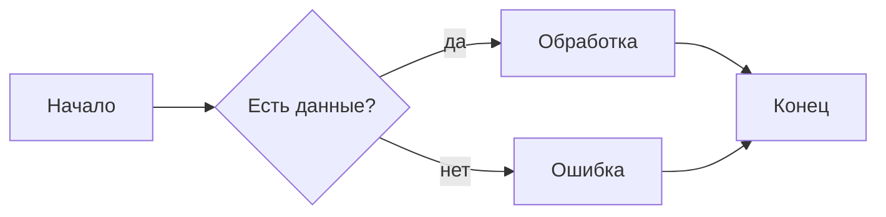

Направление: `TB` — сверху вниз, `LR` — слева направо, `RL` — справа налево.

---

## 3. Блок-схемы (Flowchart)

Самый частый тип. Описывает процессы, алгоритмы, принятие решений.

### Базовый синтаксис

```text
flowchart TD
  A[Начало] --> B{Условие}
  B -->|Да| C[Действие 1]
  B -->|Нет| D[Действие 2]
  C --> E[Конец]
  D --> E
```

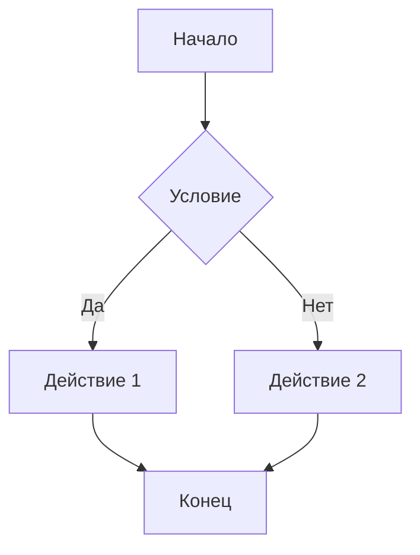

- `flowchart TD` — направление сверху вниз.
- `A[Текст]` — прямоугольный узел.
- `B{Текст}` — ромб (условный переход).
- `-->` — стрелка.
- `-->|подпись|` — стрелка с подписью.

### Типы узлов

```text
flowchart LR
  A[Прямоугольник] --> B(Скруглённый) --> C([Овал]) --> D{Ромб}
  D --> E((Круг)) --> F>Флажок] --> G{{Шестиугольник}}
```

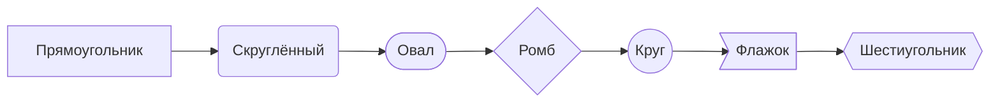

### Подграфы

Удобно для группировки этапов:

```text
flowchart TB
  subgraph Установка
    A[Скачать пакет] --> B[Установить]
  end
  subgraph Настройка
    B --> C[Системные настройки]
    C --> D[Права доступа]
  end
```

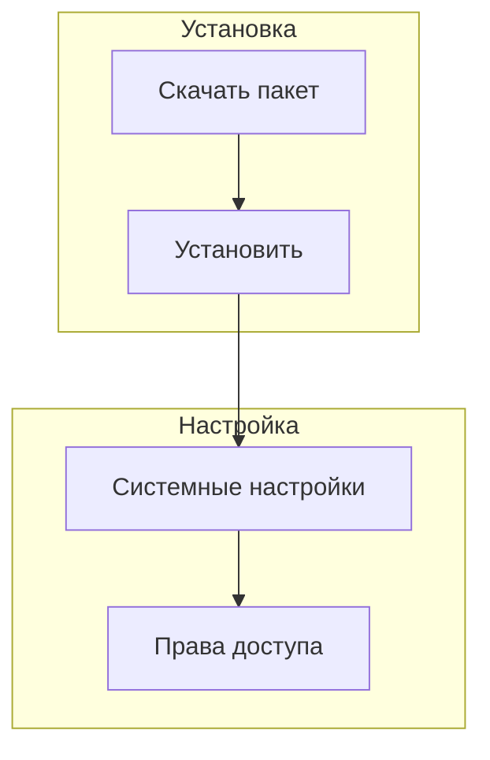

### Стилизация узлов

Можно задавать цвета и стили:

```text
flowchart LR
  A[Начало]:::green --> B{Проверка}:::orange
  B -->|Да| C[ОК]:::blue
  classDef green fill:#9f6,stroke:#333,stroke-width:2px
  classDef orange fill:#f96,stroke:#333,stroke-width:2px
  classDef blue fill:#6cf,stroke:#333,stroke-width:2px
```

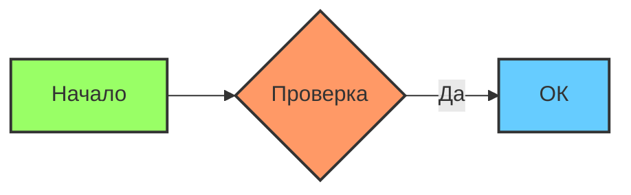

> **Важно:** в Azure DevOps `flowchart` не поддерживается — используйте `graph LR`. Также не поддерживаются `---->` и ссылки на подграфы.

---

## 4. Диаграммы последовательности (Sequence)

Для сценариев «кто кого вызывает»: API-запросы, очереди, плагины.

### Базовый пример

```text
sequenceDiagram
  participant П as Пользователь
  participant С as Сайт
  participant А as API
  П->>С: Открывает форму
  С->>А: Запрос данных
  А-->>С: JSON
  С-->>П: Страница с данными
```


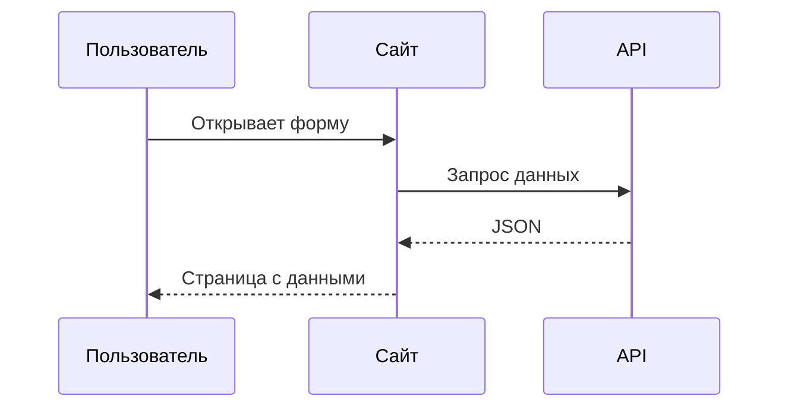

### Типы стрелок

| Стрелка | Значение |
| :--- | :--- |
| `->>` | Сплошная с наконечником |
| `-->>` | Пунктирная (ответ) |
| `-x` | Крестик на конце (ошибка) |
| `-)` | Открытая стрелка (асинхронно) |

### Циклы и условия

```text
sequenceDiagram
  participant Клиент
  participant Сервер
  loop Каждую минуту
    Клиент->>Сервер: ping
  end
  alt Успех
    Сервер-->>Клиент: pong
  else Ошибка
    Сервер-->>Клиент: timeout
  end
```

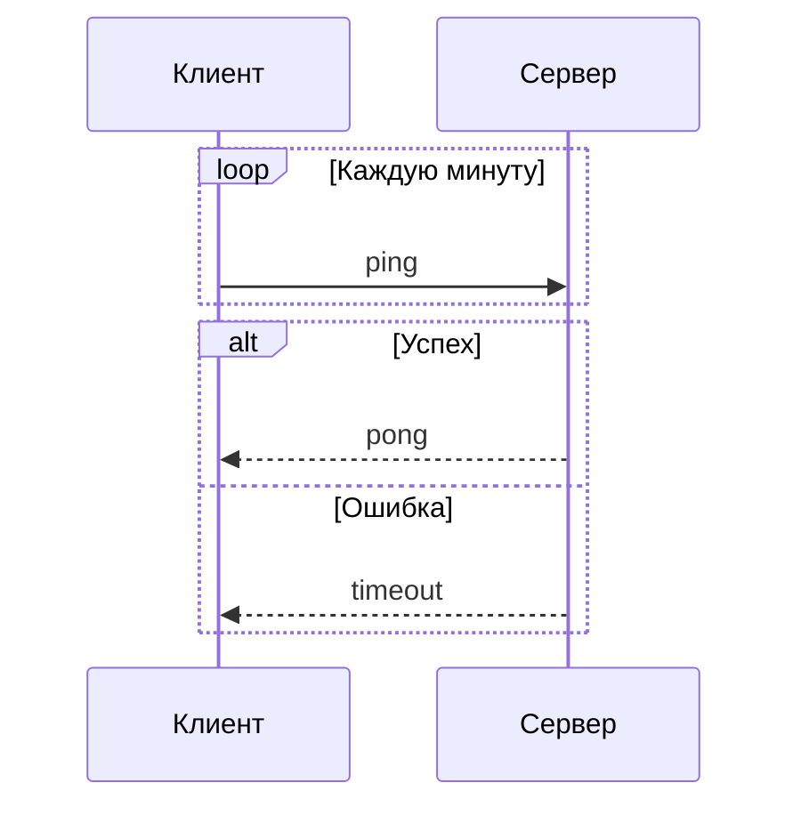

### Примечания

```text
sequenceDiagram
  participant А as Алиса
  participant Б as Боб
  Note over А,Б: Оба онлайн
  А->>Б: Привет!
  Note right of Б: Боб читает сообщение
  Б-->>А: Привет!
```

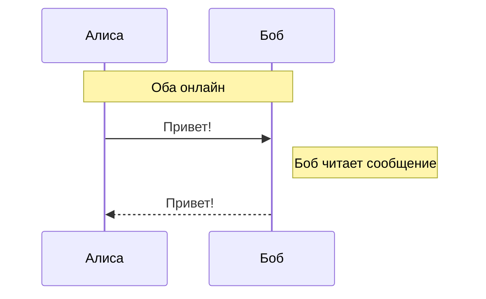

---

## 5. Диаграммы состояний (State)

Жизненный цикл заказа, статус задачи, состояния системы.

```text
stateDiagram-v2
  [*] --> Черновик
  Черновик --> Опубликован: публикация
  Опубликован --> Архив: снятие с витрины
  Архив --> [*]
```

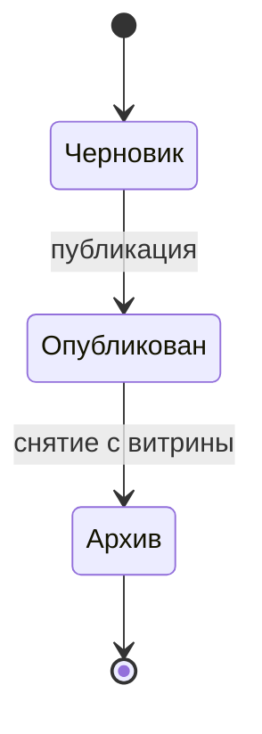

- `[*]` — начальное/конечное состояние.
- `-->` — переход.
- `: подпись` — событие, вызывающее переход.

### Составные состояния

```text
stateDiagram-v2
  [*] --> Active
  state Active {
    [*] --> NumLockOff
    NumLockOff --> NumLockOn: Нажатие NumLock
    NumLockOn --> NumLockOff: Нажатие NumLock
  }
  Active --> [*]
```

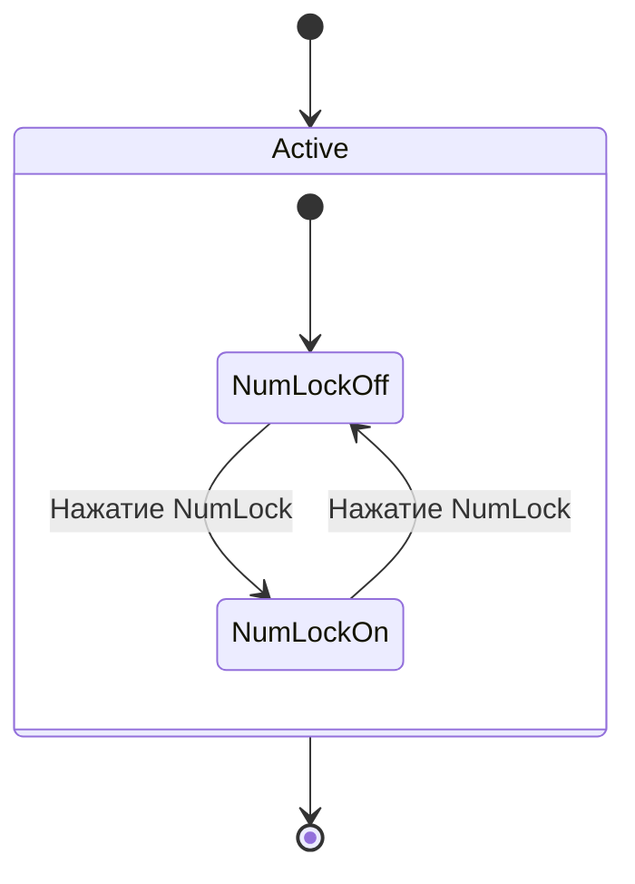

---

## 6. Диаграммы классов (Class)

Моделирование объектно-ориентированных систем: классы, атрибуты, методы, связи.

### Базовый пример

```text
classDiagram
  class Заказ {
    +int id
    +float total
    +addItem()
  }
  class Позиция {
    +int count
    +getPrice()
  }
  Заказ "1" --> "*" Позиция : содержит
```

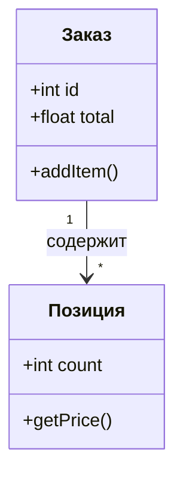

- `+` — публичный член.
- `-` — приватный.
- `#` — защищённый.
- `~` — package-private.

### Связи

| Синтаксис | Значение |
| :--- | :--- |
| `<\|--` | Наследование |
| `*--` | Композиция |
| `o--` | Агрегация |
| `-->` | Ассоциация |
| `..>` | Зависимость |
| `..\|>` | Реализация интерфейса |

### Пример с наследованием

```text
classDiagram
  Animal <|-- Duck
  Animal <|-- Fish
  Animal <|-- Zebra
  Animal : +int age
  Animal : +String gender
  Animal: +isMammal()
  class Duck{
    +String beakColor
    +swim()
    +quack()
  }
  class Fish{
    -int sizeInFeet
    -canEat()
  }
```

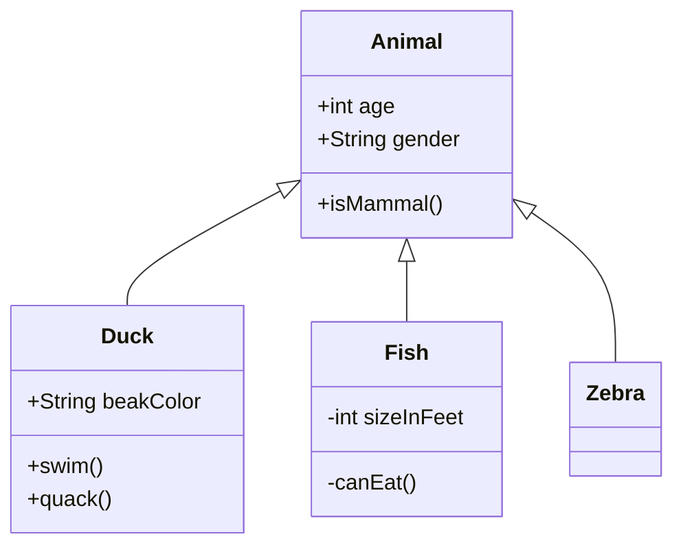

### Примечания и интерфейсы

```text
classDiagram
  class Payment {
    <<interface>>
    +authorise() bool
  }
  class CreditCard {
    +String number
  }
  Payment <|.. CreditCard
  note for CreditCard "Данные карты зашифрованы"
```

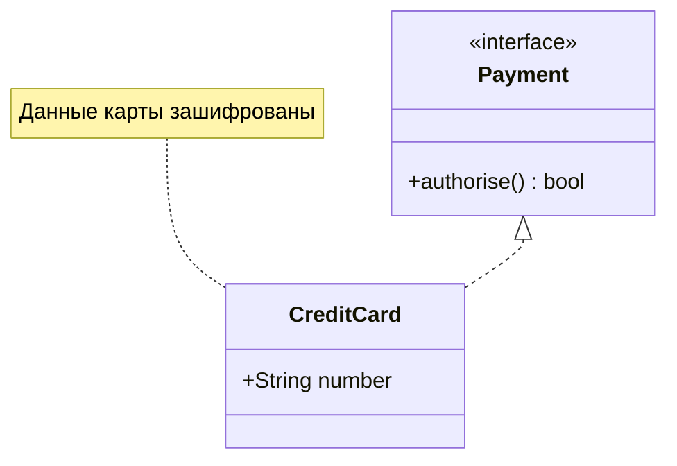

---

## 7. ER-диаграммы

Схемы баз данных: сущности, атрибуты, связи.

```text
erDiagram
  CUSTOMER ||--o{ ORDER : places
  ORDER ||--|{ LINE_ITEM : contains
  CUSTOMER {
    string name
    string email
  }
  ORDER {
    int id
    date created
  }
  LINE_ITEM {
    int quantity
    float price
  }
```

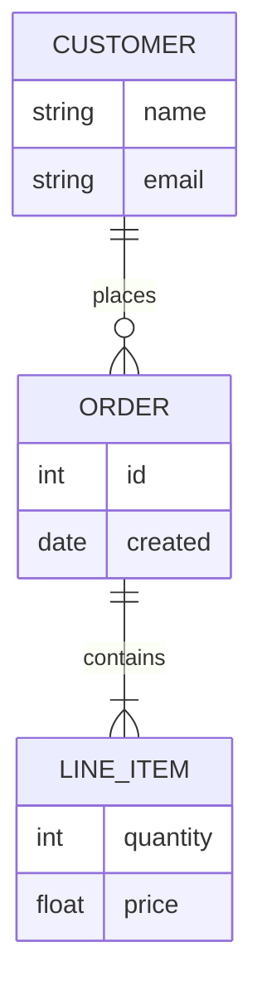

| Связь | Значение |
| :--- | :--- |
| `\|\|--o{` | Один-ко-многим |
| `\|\|--\|\|` | Один-к-одному |
| `}o--o{` | Многие-ко-многим |

---

## 8. Гант (Gantt)

Планирование проектов: задачи, сроки, зависимости.

```text
gantt
  title План разработки
  dateFormat YYYY-MM-DD
  excludes 2026-01-01, 2026-01-07
  section Проектирование
    Сбор требований :a1, 2026-01-05, 5d
    Архитектура :after a1, 3d
  section Разработка
    Бэкенд :2026-01-15, 10d
    Фронтенд :2026-01-20, 8d
  section Тестирование
    QA :2026-02-01, 5d
```

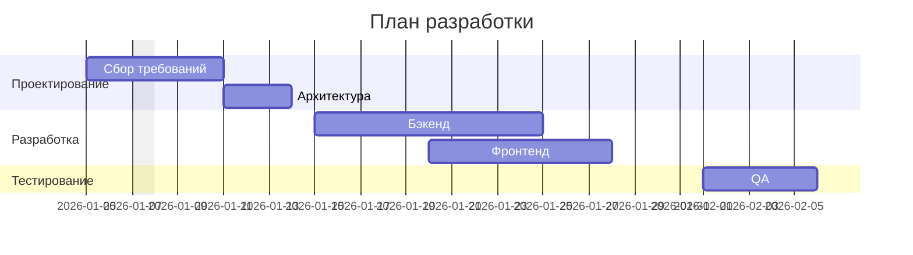

- `dateFormat` — формат даты.
- `excludes` — исключаемые дни (праздники).
- `:after a1` — зависимость от задачи `a1`.
- `:2026-01-15, 10d` — дата начала и длительность.

---

## 9. Круговая диаграмма (Pie)

Доли в процентах, подписи через двоеточие.

```text
pie title Источники трафика
  "Поиск" : 45
  "Прямые" : 30
  "Соцсети" : 25
```

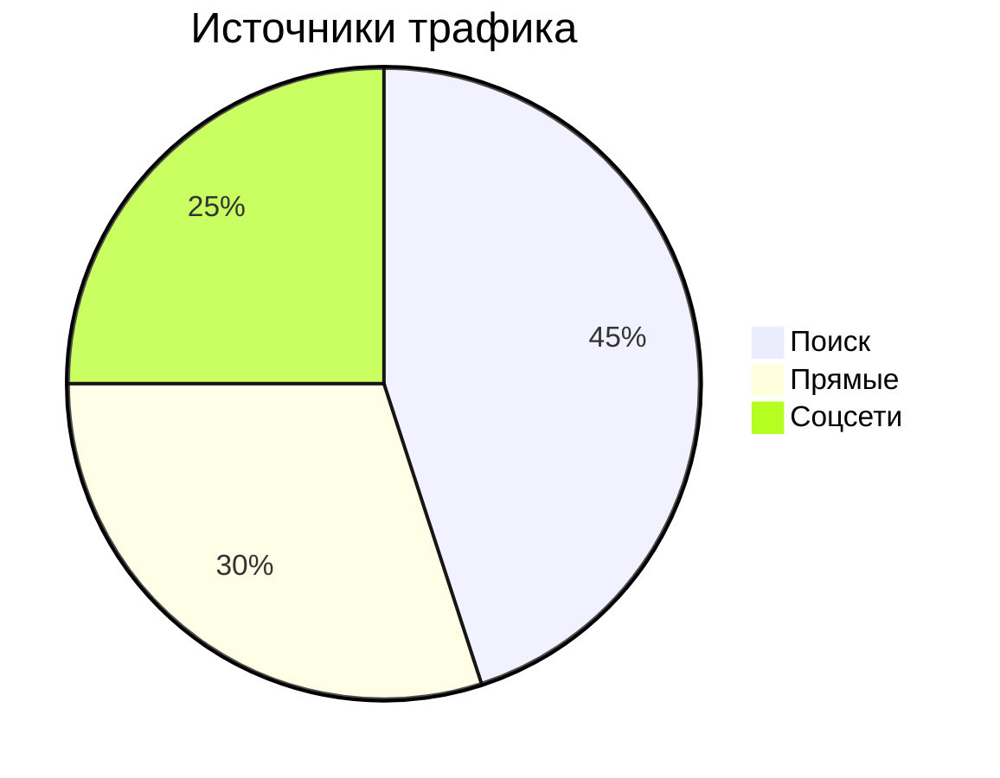

Можно добавить `showData` для отображения значений:

```text
pie showData title Продажи по регионам
  "Север" : 120
  "Юг" : 80
  "Запад" : 60
```

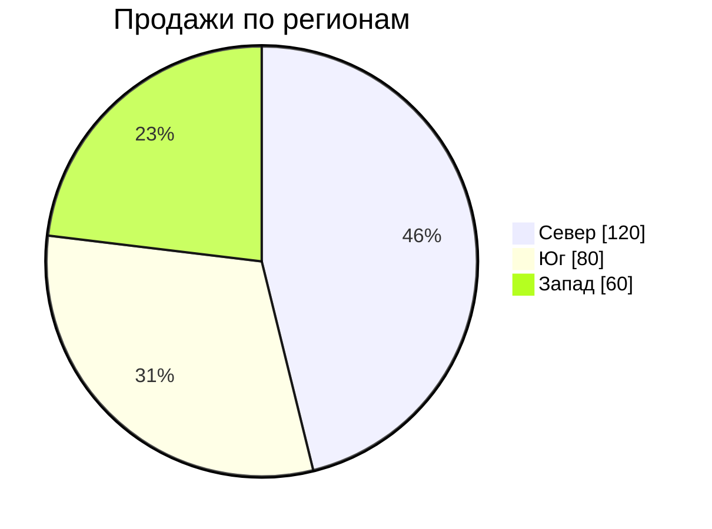

---

## 10. Git-граф (Git Graph)

Визуализация ветвления и истории коммитов.

```text
gitGraph
  commit id: "init"
  branch develop
  checkout develop
  commit id: "feat-1"
  commit id: "feat-2"
  checkout main
  merge develop
  commit id: "release"
```

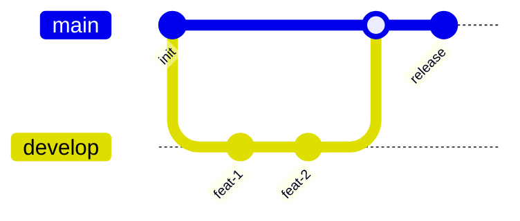

- `commit` — коммит.
- `branch` — создать ветку.
- `checkout` — переключиться.
- `merge` — слияние.

---

## 11. Диаграмма пользовательского пути (Journey)

Описывает шаги пользователя при выполнении задачи.

```text
journey
  title Рабочий день
  section Дорога на работу
    Проснуться: 1: Я, Собака
    Принять душ: 2: Я
    Выпить кофе: 4: Я
  section Работа
    Писать код: 5: Я
    Созвон: 3: Я, Коллеги
  section Домой
    Ужин: 5: Я, Семья
```

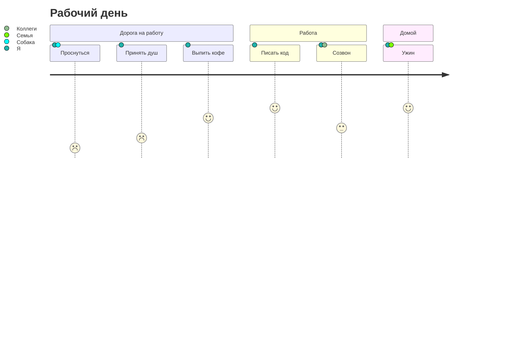

Число после двоеточия — оценка (1–5).

---

## 12. Другие типы диаграмм

Mermaid поддерживает ещё несколько типов:

| Тип | Ключевое слово | Для чего |
| :--- | :--- | :--- |
| **Mindmap** | `mindmap` | Интеллект-карты |
| **Timeline** | `timeline` | Хронология событий |
| **Quadrant** | `quadrantChart` | Матрица 2×2 (приоритизация) |
| **Requirement** | `requirementDiagram` | Требования |
| **C4** | `C4Context` | Архитектура систем |
| **Sankey** | `sankey-beta` | Потоки данных |

Полный список — в официальной документации.

---

## 13. Стилизация и темы

### Встроенные темы

Mermaid имеет несколько готовых тем:

| Тема | Для чего |
| :--- | :--- |
| `default` | Стандартная |
| `dark` | Для тёмного режима |
| `neutral` | Чёрно-белая (для печати) |
| `forest` | Зелёные тона |
| `base` | Только она поддаётся кастомизации |

### Настройка через frontmatter

В VitePress можно задать тему для конкретной диаграммы:

````text
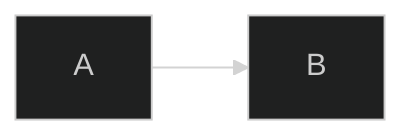
````

````markdown
```mermaid
---
config:
  theme: dark
---
flowchart LR
  A --> B
```
````

Или через контейнер плагина:

```text
:::mermaid
config:
  theme: dark
sequenceDiagram
  A->>B: Привет
:::
```

```markdown
:::mermaid
config:
  theme: dark
sequenceDiagram
  A->>B: Привет
:::
```

### Кастомизация на основе `base`

````text
```mermaid
---
config:
  theme: base
  themeVariables:
    primaryColor: "#ff6b6b"
    primaryTextColor: "#fff"
    lineColor: "#333"
---
flowchart LR
  A[Старт] --> B[Финиш]
```
````

````markdown
```mermaid
---
config:
  theme: base
  themeVariables:
    primaryColor: "#ff6b6b"
    primaryTextColor: "#fff"
    lineColor: "#333"
---
flowchart LR
  A[Старт] --> B[Финиш]
```
````

> **Совет:** если диаграмма не отображается, проверьте отступы, закрытие блока тремя кавычками и отсутствие опечаток в ключевых словах.

---

## 14. Интеграция с VitePress

### Установка плагина

```bash
npm install @vitepress-plugin/mermaid
# или
pnpm add @vitepress-plugin/mermaid
# или
yarn add @vitepress-plugin/mermaid
```

### Настройка

В `.vitepress/config.mts`:

```javascript
import { defineConfig } from 'vitepress'
import mermaidPlugin from '@vitepress-plugin/mermaid'

export default defineConfig({
  vite: {
    plugins: [
      mermaidPlugin(),
    ],
  },
})
```

### Использование в Markdown

После настройки можно использовать как стандартный fenced-блок, так и контейнер:

```markdown
:::mermaid
flowchart LR
  A[Hard edge] -->|Link text| B(Round edge)
  B --> C{Decision}
  C -->|One| D[Result one]
  C -->|Two| E[Result two]
:::
```

### Настройка на уровне контейнера

Можно переопределить тему и высоту для конкретной диаграммы:

```markdown
:::mermaid
containerHeight: 500
config:
  theme: dark
flowchart TD
  A --> B
:::
```

---

## 15. Советы и частые ошибки

### Что проверить, если диаграмма не рендерится

1. **Ключевое слово** — `flowchart`, `sequenceDiagram`, `stateDiagram-v2` и т.д. Опечатка = ошибка.
2. **Закрытие блока** — три бэктика на отдельной строке.
3. **Отступы** — лишние пробелы в начале строк могут сломать парсер.
4. **Спецсимволы в тексте** — кавычки, скобки внутри узлов могут конфликтовать с синтаксисом. Экранируйте или используйте кавычки.

### Советы по оформлению

- **Не перегружайте.** Сложную схему лучше разбить на две простые.
- **Кириллица работает**, но если что-то странно — попробуйте упростить текст в узлах или использовать короткие `id` с `as`: `participant П as Пользователь`.
- **Используйте подграфы** для группировки этапов — так читается легче.
- **Проверяйте рендер** в предпросмотре VitePress или на [Mermaid Live Editor](https://mermaid.live/).

### Частые ошибки

| Ошибка | Решение |
| :--- | :--- |
| `flowchart` не работает в Azure DevOps | Используйте `graph LR` |
| `---->` не поддерживается | Используйте `-->` |
| Ссылки на подграфы не работают в Azure DevOps | Уберите ссылки, оставьте только вложенность |
| Тёмная тема не подхватывается | Проверьте, что плагин настроен и тема сайта переключается |

---

## 16. Шпаргалка

```mermaid
flowchart LR
  A[Прямоугольник] --> B{Ромб}
  B -->|Да| C(Скруглённый)
  B -->|Нет| D([Овал])
```

```mermaid
sequenceDiagram
  participant A as Алиса
  participant B as Боб
  A->>B: Запрос
  B-->>A: Ответ
```

```mermaid
stateDiagram-v2
  [*] --> Состояние1
  Состояние1 --> Состояние2: событие
  Состояние2 --> [*]
```

```mermaid
classDiagram
  class A {
    +int x
    +method()
  }
  class B
  A <|-- B
```

```mermaid
erDiagram
  A ||--o{ B : has
```

```mermaid
gantt
  title План
  dateFormat YYYY-MM-DD
  section Этап
    Задача :a1, 2026-01-01, 5d
```

```mermaid
pie title Доли
  "A" : 60
  "B" : 40
```

```mermaid
gitGraph
  commit
  branch dev
  checkout dev
  commit
  checkout main
  merge dev
```

```mermaid
journey
  title Путь
  section Этап
    Шаг: 5: Я
```

---

## Итог

- **Mermaid** — текстовый язык для диаграмм, который рендерится в Markdown.
- Основные типы: **flowchart**, **sequenceDiagram**, **stateDiagram-v2**, **classDiagram**, **erDiagram**, **gantt**, **pie**, **gitGraph**, **journey**.
- Вставляется через fenced-блок с языком `mermaid` или контейнер `:::mermaid`.
- В VitePress подключается плагином `@vitepress-plugin/mermaid`.
- Тёмная и светлая темы подхватываются автоматически.
- Диаграммы версионируются вместе с кодом — это их главное преимущество.
- Проверяйте рендер в предпросмотре и не перегружайте схему.

**Полезные ссылки:**

- [Официальная документация Mermaid](https://mermaid.js.org/)
- [Mermaid Live Editor](https://mermaid.live/) — онлайн-редактор для проверки синтаксиса
- [@vitepress-plugin/mermaid](https://www.npmjs.com/package/@vitepress-plugin/mermaid) — плагин для VitePress
- [draw.io: Mermaid syntax](https://www.drawio.com/doc/faq/mermaid) — ещё один справочник
